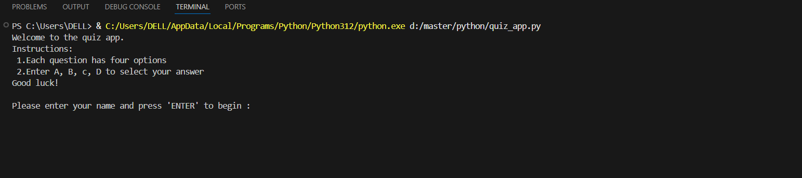
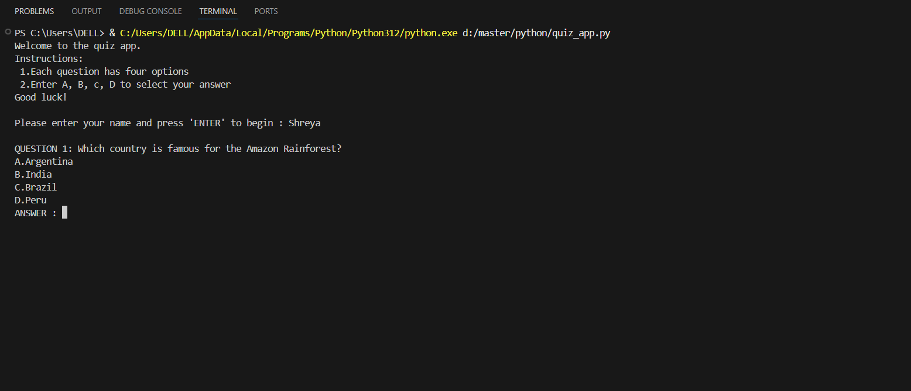

# Quiz-app-using-console---python
A simple command-line quiz app built using python.

It allows the user to:
- Answer multiple-choice questions one-by-one
- Verify the The user’s answers
- Display the result, score and percentage

---

# Features

- Interactive quiz with multiple-choice questions
- Score tracking
- Immediate feedback after each question
- User-friendly interface using print and input
- Input Validation
- Final result display

---

# Concepts used
- Input / Output operations
- Conditional statements
- Loops 
- String methods
- Arithmetic operations and percentage calculation
- Score tracking using variables
- Input validation logic

---

# How to run

1. Make sure you have Python installed.
2. Download or clone this repository.
3. Run the file:
   ```bash
   python quiz_app.py

---

# Output
- Start the quiz
  


- Enter the option to select answer
  



- User-friendly input validaion
  


- Final result displayed
  


